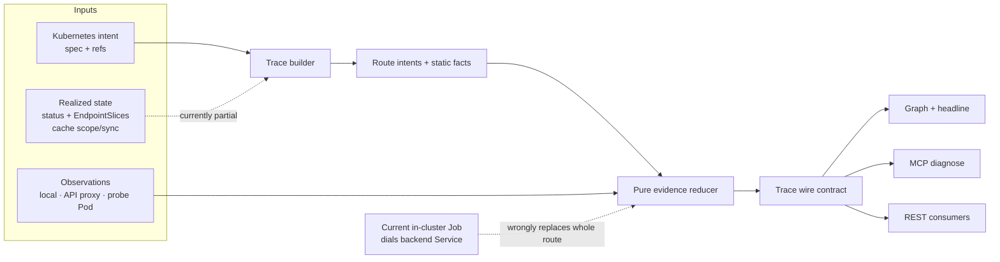

# PR #1037 consolidated review

## Outcome

**Request changes. Do not merge this head.**

The product direction is good and several implementation primitives are unusually careful: probe vantage is explicit, API-server proxy evidence is normally kept indirect, skipped probes do not become failures, the transient Job is well hardened, redirects are not followed, direct dials guard metadata/loopback targets after DNS resolution, and the REST/MCP mutation gates generally preserve caller RBAC plus the Cloud role boundary.

The system is not yet honest end-to-end, however. The central abstraction currently collapses:

- declared route intent into a unique backend/port;
- observations of different path segments into one mutable `RouteResult`;
- desired/spec state into controller-realized Kubernetes state; and
- a timestamped probe response into the current resource snapshot.

That allows a direct probe of a healthy backend Service to erase a failed Ingress/Gateway entry and return green; leaks hidden reverse dependencies from Radar's shared cache; falsely breaks valid `publishNotReadyAddresses` Services; and lets the UI keep displaying a stale green or red snapshot after the cluster has changed.

The safest path is to split the mutating in-cluster feature back out, stabilize the route/evidence model and request-scoped authorization first, and then reintroduce active observations as segment-scoped, timestamped evidence.

## Exact review scope and integration state

| Item | Value |
|---|---|
| PR | [skyhook-io/radar#1037](https://github.com/skyhook-io/radar/pull/1037) |
| Reviewed base | `1b9ad55632e0e72abcdd28bc4e700b7020753dad` |
| Reviewed head | `d1face5b31572eb94afcd29920b93684f42281d3` |
| Diff size | 81 files, +23,128 / -55, 13 commits |
| Review method | Read-only exact-object inspection; no source changes and no live cluster probes |
| Head status | Still the live PR head when rechecked; GitHub reports `mergeable=false`, `mergeable_state=dirty` |
| CI at reviewed head | Backend, frontend, shared packages, Helm and CodeQL pass; Bugbot is neutral |
| Divergence from current `main` | 13 PR-only commits vs 52 main-only commits; 23 files touched on both sides |
| Textual conflicts | 11 conflict hunks across 6 files: `internal/config/config.go`, topology node rendering, shared workload view + exports, shared utils export, and web workload view |

The semantic review below is against the original PR head, not an imagined conflict resolution. The conflict-heavy workload/UI files and config need another focused review after rebase; resolving markers is not enough.

## Architecture map



The model that would make the honesty rules enforceable is:

```text
RouteIntent ID
  = entry UID + listener/parent + hostname + match + backend namespace/name/port

Observation ID
  = RouteIntent ID + segment + target + vantage/source identity + attempt timestamp

Final trace
  = pure reduction(static facts, realized state, immutable observations)
```

Backend analysis may be deduplicated internally, but backend reuse must not deduplicate the user-visible route intentions. A Service-direct observation attaches to the Service segment; it cannot replace evidence about DNS, a load balancer, listener attachment, Gateway matching, or ingress-controller programming.

## Merge blockers

### 1. Backend-only Job success can heal a failed front door

`RunInClusterTests` dials `RouteResult.Target`, which is the backend Service. It carries Host/path as request metadata but never traverses the Ingress/Gateway address or controller. `ApplyInClusterResults` then replaces the entire route with that Service result, recomputes from static findings without re-running `reviseVerdictWithProbes`, and can erase the entry failure.

Concrete causal sequence:

1. Public entry TCP/HTTP probe fails; the entry verdict becomes broken.
2. The throwaway Job dials `api:8080` directly and gets 200.
3. The route is replaced with `verified/real` from the backend segment.
4. Static recomputation no longer consumes the surviving failed front-door hop.
5. Coverage can ship healthy while the hop matrix still contains the failed entry.

Evidence: [Codex probe review §1](codex/02-probe-security.md#1-high--the-in-cluster-route-check-bypasses-the-entry-path-then-replaces-the-whole-route-with-the-backend-only-result) and [Codex honesty review §1](codex/03-honesty-model.md#1-high-a-service-direct-job-can-turn-an-unreachable-ingressgateway-into-healthy).

**Required fix:** observations must be segment-scoped and additive. Never replace an entry observation with a backend observation. A true end-to-end check must dial the programmed entry/listener with the intended Host/SNI/path and retain its vantage qualification.

### 2. Route identity collapses distinct host/path intentions, and the fold is not idempotent

Ingress/Gateway traversal deduplicates backend Services before route construction. Host/path rules that share a backend become one joined route label and one coverage/result key; method/header/query matches are not represented. Separately, `ApplyInClusterResults(trace, emptyMap)` still clears the reason, recomputes a static verdict, prunes gaps, and can erase a legitimate probe-derived broken/degraded verdict without adding evidence.

Consequences include:

- `/web -> app:80` and `/admin -> app:80` count as one route;
- testing one host/path can vouch for its sibling;
- a valid and invalid port on the same Service can be reduced as one branch;
- the answer changes under an empty fold; and
- `worstOutcome` changes under probe reordering.

Evidence: [Codex honesty review §§2-4, 7-8](codex/03-honesty-model.md#2-high-route-identity-is-actually-unique-backendport-identity-collapsing-distinct-hostpath-rules-and-corrupting-counts-and-attribution).

**Required fix:** introduce structured `RouteIntent` identity, make the reducer pure/idempotent/permutation-invariant, and test the complete output tuple—not only `verdict`—under empty and repeated folds.

### 3. Request RBAC is bypassed by reverse walks and controller discovery

Radar's shared cache may have broader visibility than the caller. Service→Route and Gateway→Route reverse walks scan it cluster-wide and return the exact kind/name/namespace of an object the caller cannot list; only its findings are hidden. Ingress controller discovery also exposes cluster-scoped IngressClass controller strings and controller Pod replica counts without the request's exact authorization.

This is a real auth-enabled information disclosure, not cosmetic redaction. The in-scope Service/Gateway does not contain those reverse object identities.

Evidence: [Codex path review §1](codex/01-path-semantics.md#1-high--security-redacted-reverse-dependencies-still-disclose-hidden-object-identities-and-controller-discovery-bypasses-request-rbac) and [Claude path review §3](claude/01-path-semantics.md#finding-3--reverse-cross-namespace-walk-discloses-name--namespace-of-resources-in-namespaces-the-caller-cant-read-low-medium-info-disclosure).

**Required fix:** request-facing reverse indexes must use authorized namespaces, cluster-scoped facts need the same exact SAR boundary as other reads, and serialized-response tests must prove hidden names/counts never appear.

### 4. Pod readiness is treated as the Service dataplane, producing false endpoint verdicts

The trace reconstructs Service routing from selector-matched Pods and raw `PodReady`, rather than EndpointSlices. The immediate hard bug is `publishNotReadyAddresses`: Kubernetes may publish those endpoints as ready by design, while Radar reports `0/N ready`, excludes them from probing, and can emit a critical broken path. Selectorless/custom EndpointSlices, terminating/serving state, per-endpoint ports, topology hints and traffic-policy locality also cannot be represented correctly.

Kubernetes documents EndpointSlice `ready` as the routing signal and explicitly notes the `publishNotReadyAddresses` override in the [EndpointSlice API](https://kubernetes.io/docs/reference/kubernetes-api/discovery/endpoint-slice-v1/).

Evidence: [Codex path review §2](codex/01-path-semantics.md#2-high-the-trace-uses-pod-readiness-as-authoritative-service-routing-and-falsely-breaks-publishnotreadyaddresses-services).

**Required fix:** make EndpointSlices the source of realized backend/port state; keep Pod readiness as separate application-health evidence. At minimum, fix `publishNotReadyAddresses` consistently before merge.

### 5. Gateway API intent is promoted to an attached, reachable path without realized status

Cross-namespace backends are followed without a `ReferenceGrant`; Gateway listener `allowedRoutes` and Route `status.parents[].conditions` (`Accepted`, `ResolvedRefs`) are ignored. A controller-rejected route is therefore drawn as attached, and the backend-direct Job can “confirm” it.

The Gateway API states that cross-namespace references are invalid without a grant and that implementations must recompute validity on grant changes ([ReferenceGrant](https://gateway-api.sigs.k8s.io/reference/api-types/referencegrant/)). Route parent status is the observed attachment state ([HTTPRoute status](https://gateway-api.sigs.k8s.io/reference/api-types/httproute/)).

Evidence: [Claude path review §§1-2](claude/01-path-semantics.md#finding-1--gateway-api-cross-namespace-refs-ignore-referencegrant--allowedroutes--false-reachable-medium-high) and [Codex path review §7](codex/01-path-semantics.md#7-medium-gateway-traces-silently-ignore-supported-l4-route-kinds).

**Required fix:** consume controller status and ReferenceGrant/allowedRoutes semantics. Preserve requested-but-rejected intent for diagnosis, but label it rejected rather than attached/reachable.

### 6. Ingress controller intent is reported as proof of service

A known class or cloud-looking annotation can produce a quiet “Served by” result even with no load-balancer address and no observed controller. The AWS branch is based on a factually wrong premise that there are no controller Pods; AWS LBC is an in-cluster controller and continuously reconciles desired state to AWS resources ([AWS LBC architecture](https://kubernetes-sigs.github.io/aws-load-balancer-controller/latest/how-it-works/)).

Evidence: [Codex path review §3](codex/01-path-semantics.md#3-high-ingressclass-and-cloud-annotations-are-treated-as-proof-that-an-ingress-is-being-served).

**Required fix:** distinguish configured, controller observed, programmed address/status, and actively verified. Class/annotation alone is intent, never “served.”

### 7. Cache scope and sync are not carried with absence/completeness claims

An out-of-scope Service lister miss becomes a confirmed missing backend because only Pod emptiness checks `KindCoversNamespace`. Dynamic reverse walks use a non-blocking partial snapshot as a complete index when it is merely non-empty. These produce false critical missing refs and silently incomplete topology in namespace/RBAC-restricted installs or during cache warmup.

Evidence: [Codex path review §§4-5](codex/01-path-semantics.md#4-high-in-restricted-installs-an-out-of-scope-service-lister-miss-is-interpreted-as-a-confirmed-missing-backend).

**Required fix:** centralize cache lookup as `found | confirmed absent | unreadable/partial`, and make scope + sync explicit at every absence/completeness decision.

### 8. Five sequential 25-second Jobs run under a 60-second HTTP timeout

The whole-subject action permits five routes, invokes `Run` sequentially, and gives each run up to 25 seconds. The Chi route group cancels after 60 seconds. Normal scheduling, admission or image-pull latency can therefore execute several Jobs and return only a middleware timeout; retrying generates duplicate traffic.

Evidence: [Codex probe review §3](codex/02-probe-security.md#3-high--five-sequential-25-second-jobs-are-mounted-under-a-60-second-request-timeout).

**Required fix:** one aggregate deadline below the handler limit; one capability check per namespace; bounded concurrency or one multi-target Job; explicit budget-exhausted rows for unfinished routes.

### 9. A completed probe snapshot permanently masks the live static state

`useTrace` polls every five seconds, but after the tab's automatic probe completes, `baseTrace = probeTrace ?? staticTrace`. `probeTrace` is held until resource/path change, so later static snapshots for the same resource are invisible. Fixing an outage can leave Radar red forever; a new outage can leave it green forever. In-cluster results inherit the same mask.

Evidence: [Codex UI/contract review §1](codex/04-ui-contract.md#1-high-the-first-probe-result-permanently-masks-all-subsequently-polled-static-state).

**Required fix:** store timestamped observations separately from the latest static snapshot, bind evidence to a subject generation, and invalidate/mark stale when the cluster state changes.

### 10. The published Radar package accepts incompatible `k8s-ui` peers

The PR imports new trace components/types from `@skyhook-io/k8s-ui`, but `web/package.json` still accepts every version `>=1.7.3`. Those exports do not exist at the base. Workspace aliases hide the failure; a clean Radar Hub/source-package consumer can legally install an older peer and fail to compile/load.

Evidence: [Codex UI/contract review §2](codex/04-ui-contract.md#2-high-for-the-published-package-radar-app-still-accepts-k8s-ui-versions-that-do-not-export-any-of-the-new-symbols-it-imports).

**Required fix:** publish the compatible `k8s-ui` first, raise Radar app's minimum peer version, then validate a packed clean consumer using that minimum version.

## Important accepted findings after the blockers

| Area | Finding | Disposition |
|---|---|---|
| Probe semantics | TLS Ingress hosts are always also required to pass port 80, falsely failing valid HTTPS-only entries | Fix; model HTTP and HTTPS entry surfaces separately ([report](codex/02-probe-security.md#4-medium--every-tls-ingress-host-is-also-required-to-pass-port-80)) |
| Probe semantics | Whole-subject Gateway in-cluster action has no `InClusterRequest`, so the advertised operation silently creates no Job | Fix eligibility or implement listener-scoped requests ([report](codex/02-probe-security.md#5-medium--the-supported-whole-subject-gateway-action-is-a-silent-no-op)) |
| Service semantics | ExternalName probes assumed origin `:80` with the origin Host, not declared ports/client-visible Host/SNI, and cannot run whole-subject in-cluster | Fix; official Kubernetes docs explicitly warn about HTTP Host/TLS identity differences ([report](codex/02-probe-security.md#6-medium--externalname-probing-tests-the-origin-host-on-assumed-port-80-not-how-clients-use-the-service-and-cannot-run-via-the-whole-subject-job), [Kubernetes Service docs](https://kubernetes.io/docs/concepts/services-networking/service/#externalname)) |
| Request identity | Custom probe path is ignored by the Job; `path.Clean` also changes valid HTTP targets such as trailing/repeated slashes and queries | Fix with one parsed relative-request object shared by all transports ([report](codex/02-probe-security.md#7-medium--the-custom-what-to-test-path-is-not-the-path-sent-by-the-job-and-current-normalization-corrupts-valid-http-request-targets)) |
| Deployment | Reusing Radar's image string does not copy `imagePullSecrets`, pull policy or namespace credentials, so private-registry Jobs fail | Make the execution-image contract explicit ([report](codex/02-probe-security.md#8-medium--reusing-radars-image-reference-does-not-reuse-the-credentials-or-pull-policy-needed-to-run-it)) |
| NetworkPolicy | Egress rules from policies selecting different Pods are unioned across the whole Service; DNS coverage can be falsely reassuring | Reduce per Pod, then aggregate all/some/mixed ([report](codex/01-path-semantics.md#6-medium-egress-rules-are-unioned-across-pods-even-though-networkpolicy-additivity-is-per-selected-pod), [Kubernetes NetworkPolicy semantics](https://kubernetes.io/docs/concepts/services-networking/network-policies/)) |
| Gateway inventory | Gateway attachment inventory silently omits TCPRoute/TLSRoute even though Radar already discovers them | Include static-only L4 hops or declare the coverage gap ([report](codex/01-path-semantics.md#7-medium-gateway-traces-silently-ignore-supported-l4-route-kinds)) |
| UI honesty | A failed API-server-only hop probe can paint a node red even though the route reducer correctly treats it as indirect/unknown | Apply one evidence hierarchy to node and route ([report](codex/04-ui-contract.md#3-medium-an-api-server-only-failure-can-still-paint-a-resource-red-through-nodeownstatus)) |
| Safety UX | Consent is keyed by `GetContextName`; every in-cluster/Cloud backend returns literal `in-cluster`, so consent crosses clusters on a shared Hub origin | Use a host-provided stable cluster/org identity; never persist under the sentinel ([report](codex/04-ui-contract.md#4-medium-safety-regression-dont-ask-again-for-this-cluster-is-global-across-all-in-clustercloud-clusters)) |
| Wire semantics | A real TCP/3xx/4xx `reached` route can ship raw `verdict=healthy`; UI caveats do not protect MCP consumers | Product decision, but must be explicit and tested; reserve healthy for verified 2xx or add an amber tier ([Claude F2](claude/claude-consolidated.md#f2--medium--discuss-a-real-reached-only-route-ships-verdict--healthy)) |
| Reducer | Host-only skip reconciliation can remove sibling path/port gaps; `UnknownClass` can coexist with a “Reachable — verified” headline | Fix through structured route/segment identity ([honesty report](codex/03-honesty-model.md#4-medium-skip-reconciliation-is-host-wide-and-can-hide-untested-sibling-pathsports)) |
| Controller detection | A genuinely synced empty IngressClass list is forced to “unreadable,” hiding the no-controller case | Gate on sync, not non-emptiness ([Claude F4](claude/claude-consolidated.md#f4--low-med-ingressno-controller-warning-is-suppressed-exactly-when-the-cluster-has-zero-ingressclasses)) |

Low-severity cleanup remains worthwhile: undefined `text-theme-accent`, hue-only route edges, terminating-ready Pod counting, TCP-only 53 treated as DNS coverage, host-only skipped-count dedup, delete capability/TTL wording, and unused single-target runner/API surface. These should not distract from the model fixes above.

## Existing unresolved GitHub thread adjudication

| Thread | Verdict | Evidence / replacement |
|---|---|---|
| Cross-namespace `name.namespace.svc` is guaranteed NXDOMAIN | **Reject as stated; clean up for portability.** A normal `ClusterFirst` Pod search list and `ndots` expand the partial name to the cluster domain. Kubernetes documents `service.namespace` and the full FQDN, so use the documented shorter form or a real cluster-domain-aware FQDN rather than relying on partial `.svc` expansion. [Kubernetes DNS docs](https://kubernetes.io/docs/concepts/services-networking/dns-pod-service/) |
| Rollout cache uncertainty softens a real zero-ready outage | **Reject.** The uncertain Rollout/scale-to-zero signal remains warning-level, benign softening is guarded by `hasNonBenignCriticalFinding`, and unrelated critical zero-ready evidence is not erased. Add the truth-table test, but the claimed causal bug is not present at this head. |
| Custom path was merely trim/prepend and allowed traversal | **Original literal claim is stale; replace with an accepted semantic bug.** Head now uses `path.Clean`, but filesystem normalization corrupts valid HTTP target semantics and the whole-subject Job ignores the override. See the accepted custom-path finding above. |

## Skeptical triage of Claude's consolidated report

Claude successfully delegated four subreviews and produced the requested file. Its individual findings are mostly valid, but its final “approve / no blockers” conclusion is **rejected**. It verified local guards and then inferred global safety; the missed failures occur between those guarded components.

| Claude finding | Triage | Our assessment |
|---|---|---|
| F1 Gateway ReferenceGrant/allowedRoutes/status ignored | **Accept; raise to blocker** | Correct, and backend-direct Job success amplifies it into a confident false answer. |
| F2 `reached`-only → `healthy` | **Discuss / likely fix** | Correct wire/MCP overclaim; product must pin semantics. |
| F3 host/path identity exceeds evidence | **Accept; subsumed by blocker 2** | The larger bug is backend-deduplicated route identity across all observations/folds. |
| F4 zero IngressClasses suppresses no-controller | **Accept** | Fix using cache sync authority. |
| F5 hidden reverse Route identity disclosure | **Accept; raise to high security** | This violates the request RBAC boundary; not a mere product disclosure preference. |
| F6 traffic-policy locality unmodeled | **Accept as coverage gap** | At minimum disclose node/vantage dependence; EndpointSlice model is the real fix. |
| F7 `worstOutcome` first-hit | **Accept** | Make reduction deterministic and permutation-invariant. |
| F8 terminating-ready Pods counted | **Accept; fold into EndpointSlice work** | Low symptom of using Pod readiness as endpoint truth. |
| F9 TCP-only 53 clears DNS gap | **Accept** | Also exposed by the broader cross-Pod egress union bug. |
| F10 static no-probe trace says healthy | **Discuss** | Wire wording deserves a decision; current drawer presentation mitigates it, so not a blocker alone. |
| F11 undefined accent token | **Accept** | Straight styling bug. |
| F12 hue-only/raw-hex edges | **Accept** | Accessibility/theme cleanup. |
| F13 arbitrary single-target probe | **Accept, prefer removal** | No privilege escalation, but the unused arbitrary-target mutating endpoint is unnecessary surface. |
| F14 no operator kill-switch | **Discuss** | Valuable compliance control, especially if in-cluster mutation remains in this PR. |
| F15 host-only skip dedup | **Accept; subsumed by route identity** | Cosmetic manifestation of the same keying error. |
| F16 dead single-target frontend path | **Accept; correct Claude's dependency claim** | MCP calls the shared runner directly and `radar probe` is the Job payload; neither requires this REST endpoint. Remove the dead frontend/server flow unless a real consumer exists. |

Important Claude non-finding decisions that need qualification or reversal:

| Claude conclusion | Triage |
|---|---|
| “Source-sensitive NetworkPolicy advisories survive a generic Pod pass” | **Confirm after skeptical verification.** Source-constrained rules become `netpol:advisory`; reconciliation only touches caller-independent `netpol:would-deny`. The broader backend-direct route replacement remains a separate bug. |
| “API-proxy evidence cannot condemn” | **Qualify.** Backend reducers mostly guard it, but frontend `nodeOwnStatus` colors a proxy-only failed hop red. |
| “Stale probe state is handled” | **Qualify.** Cross-resource async races are handled; same-resource static polling is permanently masked after the first probe. |
| “Public package changes are safe/additive” | **Reverse at the package-install seam.** Exports are additive in source, but the unchanged peer minimum admits packages without them. |
| “Path traversal is fixed” | **Qualify.** Traversal framing is stale, but `path.Clean` is the wrong HTTP normalizer and the Job ignores the override. |
| “No blockers / approve” | **Reject.** It omits the entry-healing fold, empty-fold non-idempotence, EndpointSlice/publish-not-ready bug, cache-scope false absence, timeout budget, UI staleness, and peer-version break. |

Claude-finding scoreboard: **14 accepted/folded, 2 product discussions, 0 rejected findings; overall approval rejected because of missed cross-seam blockers.** The unchanged Claude report is preserved verbatim at [claude-consolidated.md](claude/claude-consolidated.md).

## Recommended repair / divide-and-conquer plan

### Track A — route identity and reducer

Owner: trace-model specialist.

- Define `RouteIntent`, path segments and immutable observations.
- Preserve host/listener/match/backend/port identity.
- Make reduction pure, idempotent and order-independent.
- Add the truth matrix across no evidence, indirect, real reached, real verified, real fail, skipped, partial readiness, scale-zero and uncertainty.

Cross-review with Track C before either merges.

### Track B — Kubernetes authority and request security

Owner: Kubernetes/RBAC specialist.

- Close hidden reverse-object/controller leaks.
- Introduce EndpointSlice-backed realized Service state.
- Consume Gateway Route status, ReferenceGrant and listener attachment rules.
- Separate Ingress configured/controller-observed/programmed/verified states.
- Carry cache scope + sync authority through every lookup.
- Fix per-Pod egress aggregation and L4 attachment coverage.

Cross-review serialized responses with Track D.

### Track C — probes and mutation boundary

Owner: networking/security specialist.

- Attach observations only to the segment/source they tested.
- Record the generic probe Pod as an explicit source/vantage and never generalize its observation beyond the segment it exercised.
- Enforce one aggregate operation budget and a private-registry execution-image contract.
- Normalize one HTTP request object across direct, API-proxy and Job paths.
- Remove the dead arbitrary single-target flow; add a central disable switch if mutation remains enabled.

Cross-review all confidence upgrades with Track A.

### Track D — UI and public package

Owner: frontend/library specialist.

- Overlay timestamped probe evidence onto the latest static snapshot; surface staleness.
- Use the same indirect-failure rules for route, edge and node.
- Scope consent by stable host cluster identity.
- Fix peer-version/release ordering and test a clean packed consumer.
- Address accent token and non-color edge differentiation.

Cross-review auth/redaction presentation with Track B.

### Integration owner

One owner should maintain the end-to-end invariant matrix and reject fixes that make one surface green while another stays unknown/broken. Required integration tests:

- failed entry + healthy backend Job;
- same backend across two hosts/paths and mixed ports;
- empty/repeated fold and probe permutation;
- caller-independent NetworkPolicy deny contradicted by live traffic, alongside a source-sensitive advisory that must remain;
- `publishNotReadyAddresses` + custom/selectorless EndpointSlices;
- grant-less/rejected HTTPRoute;
- restricted cache scopes and hidden reverse resources;
- five slow routes under aggregate deadline;
- static A → probed A → static B UI sequence;
- minimum-version packed `radar-app` consumer.

## Suggested PR split

1. Route identity + pure reducer + wire truth table.
2. Static Kubernetes realization and request-scoped auth (no mutation).
3. Local/API-proxy observations as segment-scoped evidence.
4. In-cluster mutation with source identity, aggregate budget and deployment contract.
5. Reachability UI + published package integration.

That ordering keeps each reviewable and prevents the UI or Job runner from freezing an unstable wire model.

## Report index

Codex reviews:

- [01 — Kubernetes path/cache semantics](codex/01-path-semantics.md)
- [02 — probe correctness and mutation security](codex/02-probe-security.md)
- [03 — honesty/verdict model](codex/03-honesty-model.md)
- [04 — UI/public contract](codex/04-ui-contract.md)
- [05 — skeptical verification](codex/05-verification.md)

Claude reviews:

- [01 — Kubernetes path semantics](claude/01-path-semantics.md)
- [02 — probe security](claude/02-probe-security.md)
- [03 — honesty model](claude/03-honesty-model.md)
- [04 — UI/API/MCP contract](claude/04-ui-contract.md)
- [Claude consolidated report](claude/claude-consolidated.md)

Original visual map:

- [Rendered PNG](artifacts/pr1037-review-map.png)
- [Editable Excalidraw source](artifacts/pr1037-review-map.excalidraw)

## Verification note

This was a read-only architecture/correctness/security review of the exact PR objects. The existing CI is green, but the semantic cases above are not represented in that suite. No source fixes or live-cluster tests were performed. After the PR is rebased, re-review the six conflict files and run focused unit/property tests plus the real-cluster matrix before considering merge.
